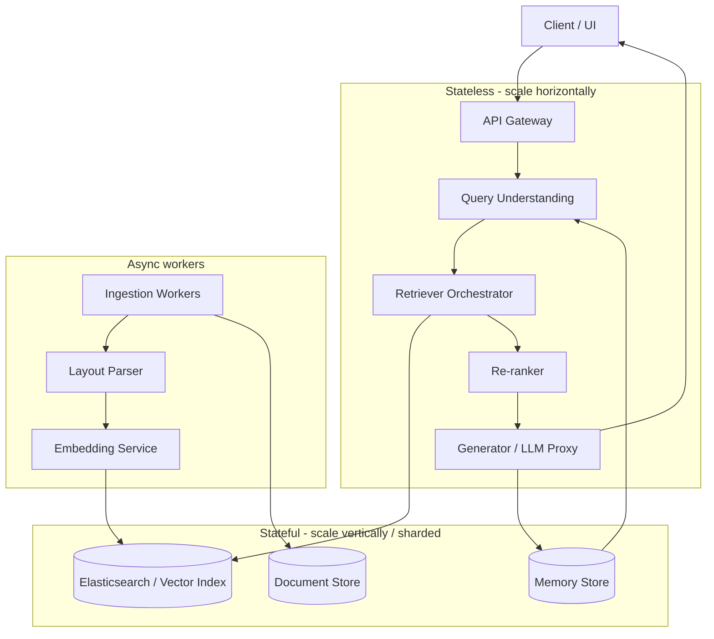

# Architectural Analysis of RAGFlow

> A systems-level evaluation of RAGFlow's design decisions across document understanding, hybrid retrieval, knowledge representation, and microservices decomposition.

---

## 1. Deep Document Understanding vs Naive Chunking (10 pts)

Fixed-size chunking (e.g. 512-token windows with overlap) is attractive because it is O(n) in document length and trivially parallelizable, but it treats documents as flat token streams. RAGFlow instead performs **layout-aware parsing**: OCR, table detection, figure extraction, and block segmentation that respects logical units (headings, paragraphs, cells, captions).

**Retrieval fidelity.** Fixed chunks frequently split semantic units: a table row from its header, a figure caption from the figure, a sentence mid-clause. Embeddings of such chunks drift toward an average of two unrelated concepts, degrading cosine similarity against a focused query. Layout-aware chunks preserve locality — a table becomes one indexable unit with its header as context, so a query over tabular data retrieves the right cell.

**Index design.** Naive chunking produces a single homogeneous index. Layout-aware parsing produces **typed chunks** (text/table/figure), which enables type-specific embeddings (e.g. table2vec for structured data) and type-specific retrievers. Downstream re-rankers can exploit chunk type as a feature.

**Preprocessing cost trade-off.** Layout analysis is expensive: OCR + DLA (document layout analysis) models run at ~1-5 pages/sec on GPU vs naive chunking at 10⁴ pages/sec on CPU. However, this cost is **amortized at ingest time**, not at query time. For read-heavy workloads (most RAG systems), the one-time ingest cost is repaid by higher top-k precision, which reduces generator hallucinations and the need for large-k retrieval.

**Failure mode:** on born-digital, single-column text (e.g. plain markdown docs), layout-aware parsing adds latency without accuracy gain — a system should route by document type.

---

## 2. Chunking Strategies: Template vs Semantic Segmentation (10 pts)

RAGFlow supports multiple chunkers because no single strategy dominates all document types.

| Strategy | Works well on | Fails on |
|---|---|---|
| **Template-based** (fixed regex / section markers) | Structured docs with stable schema: invoices, SEC filings, academic papers with standard headings | Loosely structured text — blog posts, conversations, scanned PDFs with inconsistent formatting |
| **Semantic segmentation** (embedding similarity / LLM-guided boundaries) | Free-form text where topic boundaries drift | Structured docs where it may merge unrelated sections that happen to share vocabulary |

**Trade-off analysis.** Template chunkers are deterministic, auditable, and cheap — critical for regulated domains (finance, medical) where reproducibility matters. Semantic chunkers are adaptive but introduce non-determinism: the same document chunked twice may yield different boundaries as embedding models drift. They also add O(n·d) embedding cost at ingest.

**Generalization.** The right abstraction is a **chunker registry** keyed by document type, with a classifier upstream that routes each document to the best strategy. This mirrors the compiler-design principle of specialized parsers per language rather than a universal parser.

---

## 3. Hybrid Retrieval: Lexical + Vector + Re-ranking (10 pts)

Pure dense retrieval (ANN over embeddings) and pure sparse retrieval (BM25) each have orthogonal failure modes.

**Why hybrid wins.** Let R_sparse and R_dense be the ranked lists from each retriever. Sparse retrieval excels at **rare tokens and exact matches** (product SKUs, identifiers, proper nouns) that embedding models map to generic directions. Dense retrieval excels at **paraphrase and conceptual similarity** where surface tokens differ. The union R_sparse ∪ R_dense has higher recall than either alone; a re-ranker (cross-encoder) then rescues precision by scoring query-document pairs jointly instead of via independent embeddings.

**Formal view.** If we model each retriever as a noisy channel over the true relevance function, their errors are **conditionally independent** when one uses lexical features and the other uses distributional semantics. Fusion (e.g. reciprocal rank fusion, RRF) reduces error variance in the same way ensembling reduces classifier variance.

**Failure cases:**
- **Embedding drift**: if the embedding model is trained on a domain very different from the corpus, dense retrieval contributes noise, and the hybrid system underperforms pure BM25.
- **Short queries**: "what is X" style — BM25 has nothing to match and dense carries the full burden.
- **Adversarial keyword stuffing**: BM25 can be gamed; hybrid inherits this weakness unless the re-ranker is robust.

---

## 4. Multi-Stage Retrieval: Candidate Generation → Re-ranking (10 pts)

Single-pass ANN search forces a tension between **recall** (needs large k) and **latency/cost** (grows with k). Multi-stage retrieval decouples these.

**Stage 1 (recall-oriented)**: cheap retrievers (BM25 + ANN) fetch top-K₁ (typically 100-1000) candidates. Optimized for recall — missing a relevant doc here is unrecoverable.

**Stage 2 (precision-oriented)**: a cross-encoder re-ranker scores the K₁ candidates jointly with the query and returns top-K₂ (typically 5-20). Cross-encoders are ~100× more expensive per pair than bi-encoders but only run on K₁ pairs, not the whole corpus.

**Why this beats single-pass ANN.** ANN on bi-encoder embeddings scores documents independently of the query at index time — it cannot model query-document interactions. Cross-encoders can. Running cross-encoders over the full corpus is infeasible (O(N) per query); cascading makes it O(K₁) per query while preserving most of the accuracy.

**Generalization.** This is the same principle as **multi-tier caching in CPUs** — fast/approximate first, slow/exact second — and as **cascaded classifiers in Viola-Jones face detection**. The design axiom: pay precision cost only on the candidates that survive the cheap recall filter.

---

## 5. Indexing and Storage (10 pts)

RAGFlow's indexing layer must balance lexical search, dense retrieval, and structured reasoning. The three dominant options:

| Store | Strengths | Weaknesses | Choose when |
|---|---|---|---|
| **Elasticsearch / OpenSearch** | Mature inverted index, BM25, faceting, filters, aggregations | Vector search added late, performance lags native | Rich metadata filtering, lexical search is primary, existing ES infra |
| **Vector-native DB** (Milvus, Qdrant, Weaviate) | Optimized ANN (HNSW, IVF-PQ), scales to 10⁸+ vectors, low-latency k-NN | Limited lexical search, weaker filtering | Dense-first workloads, high QPS, large vector counts |
| **Graph-augmented** (Neo4j + embeddings) | Explicit relations, multi-hop reasoning, explainability | High ingest cost, graph construction is brittle, weaker for ad-hoc text search | Entity-centric domains (biomedical, legal) where relationships drive answers |

**Design criteria.** Select based on:
1. **Query mix** — if >50% of queries have structured filters (date ranges, tags), ES wins. If most queries are semantic similarity, vector-native wins.
2. **Scale** — vector-native databases amortize HNSW index build cost better above ~10⁷ vectors.
3. **Explainability** — graph stores support "why was this retrieved" via path traversal.
4. **Operational maturity** — ES has 10+ years of ops tooling; vector DBs are catching up.

**RAGFlow's choice** of ES with vector fields is a pragmatic compromise: sacrifice peak ANN performance for operational simplicity and unified filtering.

---

## 6. Query Understanding and Transformation (10 pts)

Raw user queries are lossy. "Compare Q3 and Q4 revenue for the semiconductor division" contains implicit entities, date resolution, and a comparison operator that pure embedding similarity cannot capture.

**Why transformation matters.**
- **Normalization**: resolve pronouns, expand acronyms, canonicalize entities. Improves BM25 matching and embedding quality.
- **Decomposition**: break multi-hop queries into sub-queries (HyDE, query expansion). Each sub-query hits a narrower part of the index with higher precision.
- **Hypothetical document generation**: prompt an LLM to write a candidate answer, embed it, and retrieve against that embedding. Bridges the vocabulary gap between question phrasing and answer phrasing.
- **Iterative refinement**: retrieve → generate → re-query. Treats retrieval as a dialog with the index rather than a single shot.

**Trade-offs.** Each transformation adds LLM latency (~100-500ms) and cost. On simple factoid queries, the extra hop is wasted; a query classifier should gate expensive transformations. On compositional queries, transformation is the difference between a useful and a useless answer.

**Grounding.** This is the IR analog of **query optimization in databases** — the logical query is rewritten before execution to match the physical layout of the data.

---

## 7. Knowledge Representation: Vectors vs Relational vs Graphs (10 pts)

The representation determines what questions the system can answer.

| Representation | Good at | Bad at | Explainability |
|---|---|---|---|
| **Dense vectors** | Fuzzy similarity, paraphrase, cross-lingual | Exact lookup, compositional reasoning, negation | Low — opaque embedding space |
| **Relational schemas** | Aggregates, joins, exact filters | Semantic search over free text | High — SQL is auditable |
| **Knowledge graphs** | Multi-hop reasoning, entity relationships | Fuzzy matching, scale (~10⁷ nodes gets painful) | High — path traversal explains each answer |

**Hybrid reasoning.** Modern RAG systems increasingly combine all three: vectors for retrieval, relational for filters, graphs for reasoning. The challenge is keeping them consistent under updates — a triple store of 50M facts and a vector index of 50M chunks must reflect the same snapshot of the source corpus.

**RAGFlow's choice.** Dense vectors as primary, with metadata filters for lightweight relational queries. This is optimal for read-heavy, text-centric workloads but breaks down for queries like "find papers that cite X and were published after Y and contradict Z" — compositional queries that need graph + relational + semantic combined.

---

## 8. Data Ingestion Pipeline (10 pts)

A production ingestion pipeline must handle heterogeneous sources, schema drift, incremental updates, and failure recovery.

**Key design concerns:**

- **Schema normalization**: upstream docs have inconsistent metadata (author, date, tags). A canonical schema + per-source adapters contain this drift. Schema-on-read is tempting but pushes the problem to every query.
- **Incremental indexing**: re-indexing 10⁸ documents on every change is untenable. Use a **change-data-capture** (CDC) pattern — document hashes or version vectors identify deltas. Only deltas go through the expensive embedding + layout pipeline.
- **Consistency trade-offs** (CAP in RAG):
  - **Strong consistency** (block queries until index catches up): low write throughput, simple semantics.
  - **Eventual consistency** (queries may miss recent updates): high throughput, freshness lag (seconds to minutes).
  - RAG systems typically choose eventual consistency with a visible "last updated" timestamp — users tolerate staleness more than latency.
- **Dead-letter queues**: parsing failures (corrupt PDFs, unknown formats) must not block the pipeline. Push failures to a DLQ, continue, alert on backlog growth.
- **Backpressure**: the embedding service is the bottleneck. Rate-limit the ingestion queue to avoid OOMs downstream.

**Generalization.** This mirrors **ETL in data warehouses** and **stream processing (Kafka + Flink)** — the lessons from those domains transfer directly.

---

## 9. Memory Design for Long-Running Interactions (10 pts)

Agentic RAG needs memory that survives across turns and sessions.

| Memory type | Best for | Worst for | Cost |
|---|---|---|---|
| **Vector memory** (embed past turns) | Recall by semantic similarity, unlimited scale | Exact recall, temporal ordering | Embedding + ANN per write |
| **Structured memory** (key-value / SQL) | Exact facts, filters by time/user/session | Fuzzy recall, unstructured insights | Schema maintenance |
| **Episodic logs** (append-only event log) | Full auditability, replay, time-travel | Expensive to query without indexing | Storage only |

**Hybrid design.** Production agents layer all three:
- Recent turns → hot structured memory (last N messages, verbatim).
- Older turns → summarized + embedded into vector memory.
- All turns → episodic log for audit/replay.

**Forgetting strategies** matter as much as remembering: without decay (TTL, LRU, salience-weighted eviction), memory grows unbounded and embedding retrieval degrades as relevant items drown in noise.

**Failure modes.**
- **Retrieval collapse**: vector memory returns near-duplicates of recent turns, starving the context window.
- **Temporal leakage**: retrieving an old fact that contradicts a newer one, without weighting by recency.
- **Prompt injection via memory**: adversarial text written into memory is replayed into future prompts.

---

## 10. System Decomposition: Microservices Architecture (10 pts)

RAGFlow decomposes into services with distinct scaling profiles. The boundary choices reflect **Conway's law** and **independent scalability**.

**Stateless services** (API gateway, query understanding, retriever orchestrator, re-ranker, generator) scale horizontally behind a load balancer. They hold no session state — each request is self-contained. This enables autoscaling on CPU/GPU utilization.

**Stateful services** (indexes, document store, memory) scale via **sharding + replication**, not horizontal cloning. The vector index is partitioned by document ID hash; replicas handle read traffic.

**Async workers** (ingestion, parsing, embedding) are decoupled from the query path via a queue (Kafka/RabbitMQ). This prevents ingestion spikes from degrading query latency — a critical isolation property.

**Scaling strategies by service.**

| Service | Bottleneck | Scale strategy |
|---|---|---|
| API gateway | Connections | Horizontal, stateless |
| Query understanding | LLM latency | Horizontal + LLM response caching |
| Retriever orchestrator | Fan-out latency | Horizontal, async fan-out |
| Re-ranker | GPU inference | Horizontal with GPU pools, batch requests |
| Generator | GPU inference + context length | Horizontal GPU pools, KV-cache, speculative decoding |
| Vector index | Memory (HNSW graph) | Shard by doc ID, replicate for reads |
| Memory store | Write throughput | Shard by session ID |
| Embedding worker | GPU throughput | Horizontal GPU pool, batch embedding |

**Failure isolation.** Each service has its own failure domain. A generator outage degrades to "retrieval only" mode; an index outage degrades to "LLM only" (no grounding). Graceful degradation is a first-class design concern.

**Generalization.** The stateless/stateful split mirrors **12-factor apps**; the async worker decoupling mirrors **CQRS + event sourcing**. RAGFlow's architecture is an application of well-established distributed systems patterns to the RAG problem domain.

---

## Summary

RAGFlow's architectural choices reflect a consistent philosophy:
1. **Pay cost at ingest, not at query** — layout parsing, embedding, chunking are all front-loaded.
2. **Cascade from cheap to expensive** — hybrid retrieval → re-ranker → generator mirrors multi-tier caching.
3. **Decouple by failure domain** — stateless query path, stateful stores, async ingest.
4. **Route by document / query type** — no single chunker or retriever dominates.

The resulting system is a pragmatic application of IR fundamentals (BM25, cross-encoders), distributed systems patterns (sharding, CQRS, async workers), and database principles (query rewriting, CDC, eventual consistency) to the RAG problem. Its limitations — weak compositional reasoning, graph-store gaps, and memory coherence — point to the next generation of RAG systems that must combine vectors, graphs, and structured knowledge under a unified query planner.
